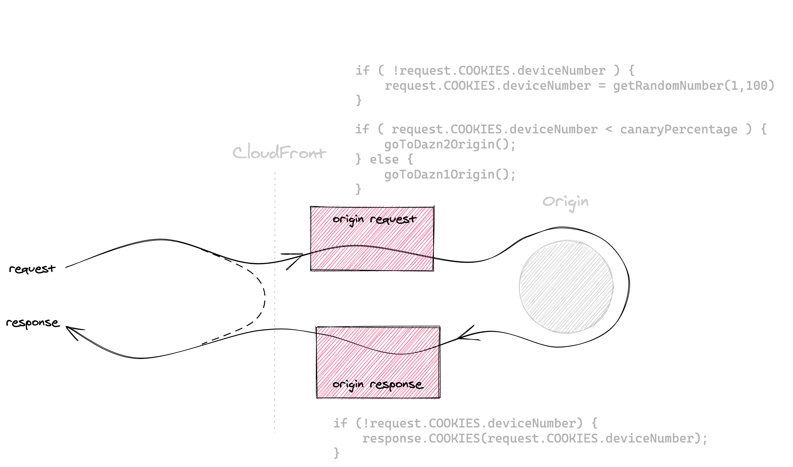

# [fit] Micro-frontends,
### [fit] **a migration story**

 
 
 

### @**_maxgallo**

---

# [fit] Hi 👋 I'm Max

### 🇮🇹 🇬🇧 🍝 💻 🎶 🏍 📷 ✈️ ✍️

### **Principal Engineer @ DAZN**

          

### twitter: @**_maxgallo**
### web: **maxgallo.io**

---

[.column]
       
#[fit] Agenda

[.column]

  

## **Context**

## **Migration**

## **Lambda @ Edge**

## **Solution Analysis**

---

<!--
### 1. Contesto

1. DAZN Constraints
2. Soluzione

### 2. Migrazione

1. Due Frontend
2. Routing Missing Part

### 3. Lambda @ Edge
- Overview
- Challenges
	- Development
	- Concurrent Limit
	- Logs & Metrics Aggregation
		- Lambda logs & cloudfront logs
- Tips

### 4. Solution Analysis
- Costs
- Check Needs VS Caracteristic
- Canary Deployment
- Runtime configuration
	-  make network calls to resources in the same region where your Lambda@Edge function is executing to reduce network latency.

### 5. TakeAways

---
-->

#[fit] Context
## **Migration**
## **Lambda @ Edge**
## **Solution Analysis**

 
 

### @**_maxgallo**

---

# Users spikes

^ Costs
^ Warm up not easily manageable

---

# Users spikes
# **-> Scalability**

---

# Company Growth

^ Example AWS account
^ Before: We didn't know who the credit card assocciated with the account belonged to
^ After: 4 account for each team, everything managed by cli

---

# Company Growth
# **-> Autonomy**

---

# Live Events

---

# Live Events
# **-> Speed**

---

[.column]

    

# **Users spikes**
# **Company Growth**
# **Live Events**

[.column]

        
# [fit] Context

---

<!--
# Holy Trinity of **AWS**

^ Static files
^ Scalability ✓
^ Authonomy ✓
^ Speed ✓

---
-->

## **Context**

#[fit] Migration

## **Lambda @ Edge**
## **Solution Analysis**

 

### @**_maxgallo**

---

# Two Frontend Applications, **Two Companies**

---

^ Same functionalities

^ Vertical Split of the whole application

^ Domain Driven Design

---

# Micro-frontends

[.footer: Micro-frontends resources: [https://medium.com/@lucamezzalira/micro-frontends-resources-53b1ec7d512a](https://medium.com/@lucamezzalira/micro-frontends-resources-53b1ec7d512a)]

^ Independent releases

---

# Migration Challenge 1

## **From Monolith to Micro-Frontends**

---

# Migration Challenge 1

## **From Monolith to Micro-Frontends**

## *-> Strangler Pattern*

^ Same URL

---

# Migration Challenge 2

## **Avoid big bang releases**

---

# Migration Challenge 2

## **Avoid big bang releases**

## *-> Canary releases*

^ Same URL

---

# Which Frontend ?

---

# The Solution

[.list: #000000, bullet-character(->), alignment(left)]
[.build-lists: true]

- __*Scale Automatically*__
- __*Fast*__
- __*Frontend Independent*__
- __*Same URL*__
- __*Strangler Pattern*__
- __*Canary Deployment*__

---

## **Context**

## **Migration**

## [fit] Lambda @ Edge

## **Solution Analysis**

 

### @**_maxgallo**

---

# Lambda @ Edge

[.list: #000000, bullet-character(->), alignment(left)]

[.build-lists: true]
An extension to AWS Lambda that lets you execute functions that custmoize the content that CloudFront delivers.

 

- __*No Infrastructure to manage*__
- __*Auto Scale*__
- __*Pay-Per-Use*__

---
 
 
 
 

## Lambda @ Edge
### Run on CloudFront

[.footer: 205 Edge Locations and 11 Regional Edge Caches]

---

# Lambda @ Edge

^ CloudFront events come input & output
^ La riga tratteggiata è dove CloudFront cacha gli oggetti

---

# Lambda @ Edge
### **CloudFront Events**      

[.footer: Full Specifications: [https://docs.aws.amazon.com/AmazonCloudFront/latest/DeveloperGuide/lambda-event-structure.html](https://docs.aws.amazon.com/AmazonCloudFront/latest/DeveloperGuide/lambda-event-structure.html) ]

---

# L@E Challenge #1

## **Concurrent Limit**

1000 concurrent executions per account, per region.

  

Example: *5000 RPS* * *6ms* execution time = *30* concurrent Lambda @ Edge

[.footer: It's possible to increment the limit up to 5000 per account, per region. Lambda @ Edge limits: [https://docs.aws.amazon.com/AmazonCloudFront/latest/DeveloperGuide/cloudfront-limits.html#limits-lambda-at-edge](https://docs.aws.amazon.com/AmazonCloudFront/latest/DeveloperGuide/cloudfront-limits.html#limits-lambda-at-edge)]

---

# L@E Challenge #2

## **Development**

Deploying Lambda@Edge can take up to 10 minutes.

       

     

^ AWS said they're improving this one.

---

# L@E Challenge #3

## **Metrics & Alarms**
Available in the region where the Lambda @ Edge did run (11 AWS Regions).

Partially aggregated in CloudFront console.

^ 11 AWS Region sono dove CloudFront ha un Regional Edge Cache

[.footer: Edge monitoring on Cloudfront: [https://aws.amazon.com/about-aws/whats-new/2019/06/announcing-enhanced-lambda-edge-monitoring-amazon-cloudfront-console/](https://aws.amazon.com/about-aws/whats-new/2019/06/announcing-enhanced-lambda-edge-monitoring-amazon-cloudfront-console/)]

---

# L@E Challenge #4

## **Lambda Logs**

CloudWatch logs in the closest region to the request (11 AWS Regions).     

^ 11 AWS Region sono dove CloudFront ha un Regional Edge Cache

[.footer: Logs Aggregation [https://aws.amazon.com/blogs/networking-and-content-delivery/aggregating-lambdaedge-logs/](https://aws.amazon.com/blogs/networking-and-content-delivery/aggregating-lambdaedge-logs/)]

---

# L@E Challenge #5

## **Lambda Validation Logs**

Lambda @ Edge outputs are validated, and results are available in CloudWatch.

Available at the log group:  __*/aws/cloudfront/LambdaEdge/DistributionId*__

[.footer: Test & Debug Lambda @ Edge: [https://docs.aws.amazon.com/AmazonCloudFront/latest/DeveloperGuide/lambda-edge-testing-debugging.html](https://docs.aws.amazon.com/AmazonCloudFront/latest/DeveloperGuide/lambda-edge-testing-debugging.html) ]
---

## **Context**

## **Migration**

## **Lambda @ Edge**

## [fit] Solution Analysis

 

### @**_maxgallo**

---

# Costs

Around __*2ms*__ of execution time

[.footer: You pay for __*Number of Requests*__ and __*GB per second*__ of memory used (granularity at 50ms) [https://aws.amazon.com/lambda/pricing/#Lambda.40Edge_Pricing](https://aws.amazon.com/lambda/pricing/#Lambda.40Edge_Pricing)]

---

# Lambda @ Edge in DAZN

[.list: #000000, bullet-character(->), alignment(left)]
[.build-lists: true]

- *Auto Scale*
- *Fast*
- *Independent from Frontend*
- *Same URL*
- **Canary Deployment**

---

# Canary Deployment
### **Two places to store the configuration**

---

# Canary Deployment
### **External Configuration**

[.footer: External data in Lambda@Edge: [https://aws.amazon.com/blogs/networking-and-content-delivery/leveraging-external-data-in-lambdaedge/](https://aws.amazon.com/blogs/networking-and-content-delivery/leveraging-external-data-in-lambdaedge/) ]

---

# Canary Deployment
### **Sticky Session**
### **+ Cookies**

---

# TakeAways

[.list: #000000, bullet-character(->), alignment(left)]
[.build-lists: true]

- Context Context Context !

- Working on the CDN is possibile

- Not only AWS (Cloudflare Workers)

- Routing & Canary Release it's just the beginning (SSR[^1], SEO [^2], Security Headers...)

[^1]: Server Side Rendering

[^2]: Search Engine Optimisation

^ Non lavoriamo più in un contesto di Client-Server, ma di Client, Server & CDN.

---

#[fit] Thank You

# [fit] **github.com/maxgallo/talk-micro-frontends-edge**

 
 
 

### @**_maxgallo**
